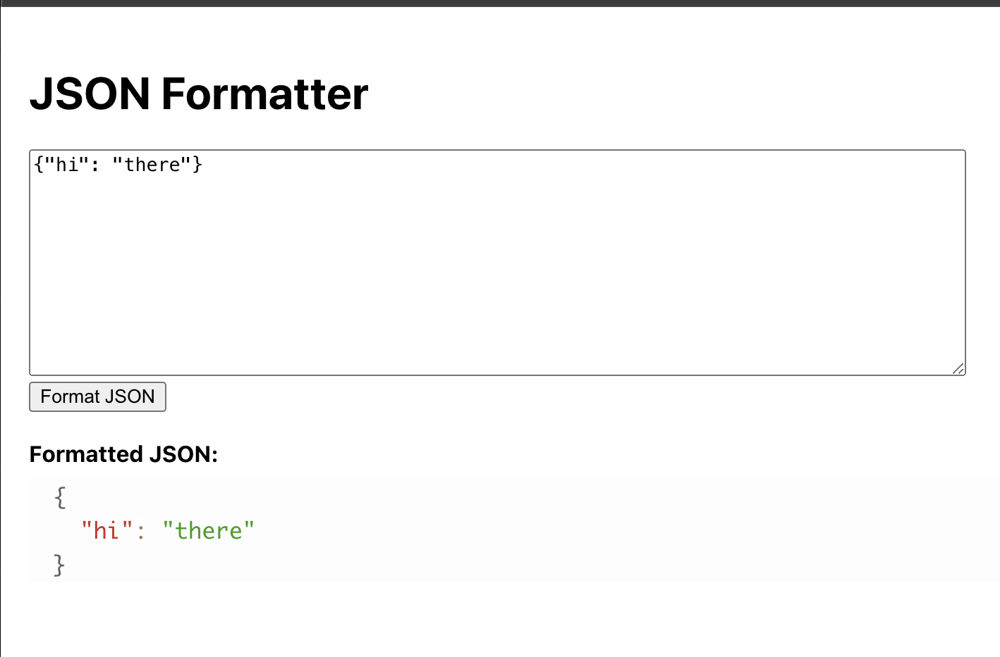

## About

This is a simple Node Express + React app that formats JSON text for you.



## Running

For dev, from the root directory:
```
npm run dev
```

To create a production build and serve it with Express:
```
cd client
npm run build
cd ..
npm start
```